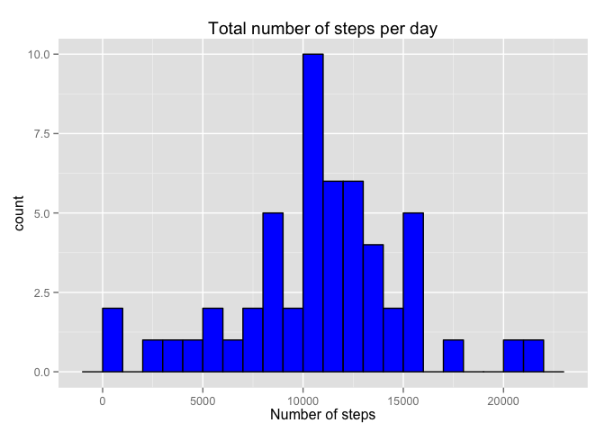
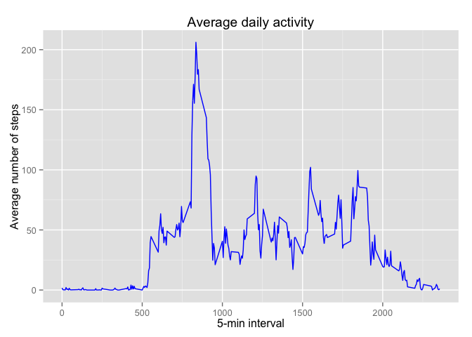
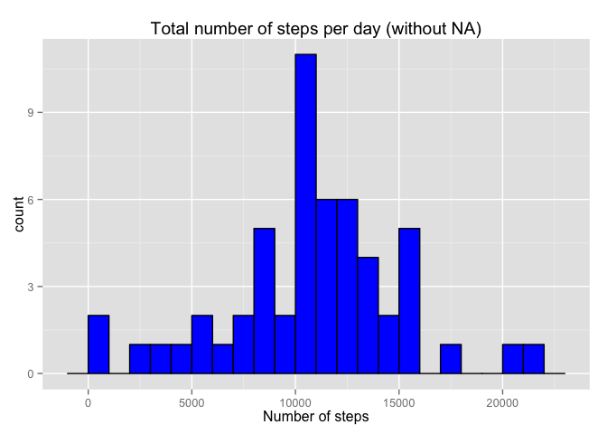
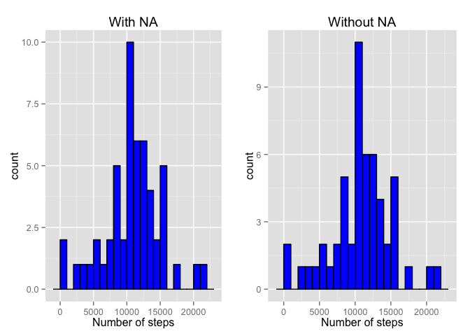
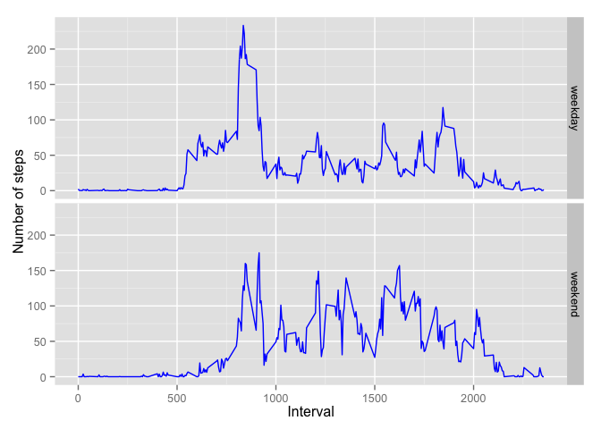

# Reproducible Research: Peer Assessment 1

## Loading and preprocessing the data
*1. Load the data (i.e. read.csv()).*

We assume that the activity.csv file lies in the working directory. 

```r
activity <- read.csv('activity.csv')
```

*2. Process/transform the data (if necessary) into a format suitable for your
analysis.*

Let's convert dates from strings to actual dates.

```r
activity$date <- as.Date(activity$date)
```

## What is mean total number of steps taken per day?
*1. Make a histogram of the total number of steps taken each day.*

```r
library(ggplot2)
actByDate <- aggregate(steps ~ date, activity, sum)
qplot(steps, data = actByDate,  binwidth = 1000, colour = I('black'), fill = I('blue'), main = 'Total number of steps per day', xlab = 'Number of steps')
```

 

*2. Calculate and report the mean and median total number of steps taken per day.*

For simplicity we will use the summary function.

```r
summary(actByDate$steps)
```

```
##    Min. 1st Qu.  Median    Mean 3rd Qu.    Max. 
##      41    8841   10760   10770   13290   21190
```

## What is the average daily activity pattern?
*1. Make a time series plot (i.e. type = "l") of the 5-minute interval (x-axis) and the average number of steps taken, averaged across all days (y-axis).*

```r
avgDay <- aggregate(steps ~ interval, activity, mean)
qplot(interval, steps, data = avgDay, geom = 'line', colour = I('blue'), main = 'Average daily activity', xlab = '5-min interval', ylab = 'Average number of steps')
```

 

*2. Which 5-minute interval, on average across all the days in the dataset, contains the maximum number of steps?*

```r
avgDay[which.max(avgDay$steps), ]
```

```
##     interval    steps
## 104      835 206.1698
```

## Imputing missing values
*1. Calculate and report the total number of missing values in the dataset
(i.e. the total number of rows with NAs).*

```r
sum(is.na(activity$steps))
```

```
## [1] 2304
```

*2. Devise a strategy for filling in all of the missing values in the dataset. The strategy does not need to be sophisticated. For example, you could use the mean/median for that day, or the mean for that 5-minute interval, etc.*

We're gonna fill the NA values with the mean for that interval across all days.

*3. Create a new dataset that is equal to the original dataset but with the missing data filled in.*

```r
activityFull <- activity
activityFull$steps[is.na(activityFull$steps)] <- avgDay[avgDay$interval == activityFull$interval[is.na(activityFull$steps)], 'steps']
```

*4. Make a histogram of the total number of steps taken each day and Calculate and report the mean and median total number of steps taken per day. Do these values differ from the estimates from the first part of the assignment? What is the impact of imputing missing data on the estimates of the total daily number of steps?*

```r
actByDateFull <- aggregate(steps ~ date, activityFull, sum)
qplot(steps, data = actByDateFull,  binwidth = 1000, colour = I('black'), fill = I('blue'), main = 'Total number of steps per day (without NA)', xlab = 'Number of steps')
```

 

Now let's compare the two histograms:

```r
library(gridExtra)
q1 <- qplot(steps, data = actByDate,  binwidth = 1000, colour = I('black'), fill = I('blue'), main = 'With NA', xlab = 'Number of steps')
q2 <- qplot(steps, data = actByDateFull,  binwidth = 1000, colour = I('black'), fill = I('blue'), main = 'Without NA', xlab = 'Number of steps')
grid.arrange(q1, q2, nrow=1, ncol=2)
```

 

The plots look pretty much the same, supposedly because the data were missing for **whole days** and we filled it will the 'average day' data. Therefore it didn't impact the distribution.

Let's compare means and medians.

With NA:

```r
summary(actByDate$steps)
```

```
##    Min. 1st Qu.  Median    Mean 3rd Qu.    Max. 
##      41    8841   10760   10770   13290   21190
```

And without NA:

```r
summary(actByDateFull$steps)
```

```
##    Min. 1st Qu.  Median    Mean 3rd Qu.    Max. 
##      41    8860   10770   10770   13190   21190
```

The means are the same (well, yes, because we've filled NA values with mean values for intervals). The medians differ only slightly.

## Are there differences in activity patterns between weekdays and weekends?
*1. Create a new factor variable in the dataset with two levels – “weekday” and “weekend” indicating whether a given date is a weekday or weekend day.*

```r
library(chron)
activityFull$dayType <- factor(is.weekend(activityFull$date), labels = c('weekday', 'weekend'))
```

*2. Make a panel plot containing a time series plot (i.e. type = "l") of the 5-minute interval (x-axis) and the average number of steps taken, averaged across all weekday days or weekend days (y-axis).*

```r
avgDayFull <- aggregate (steps ~ interval + dayType, activityFull, mean)
qplot(interval, steps, data = avgDayFull, geom = 'line', facets = dayType ~ ., colour = I('blue'), xlab = 'Interval', ylab = 'Number of steps')
```

 

THE END!
